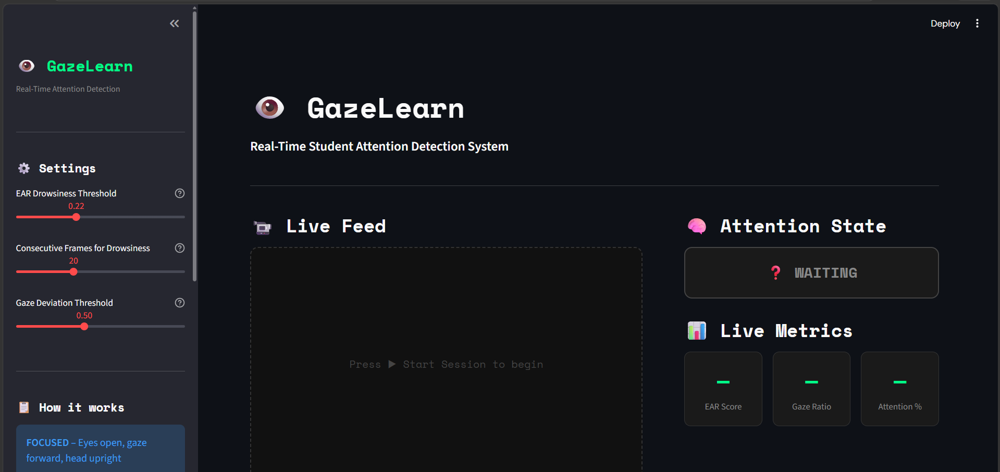
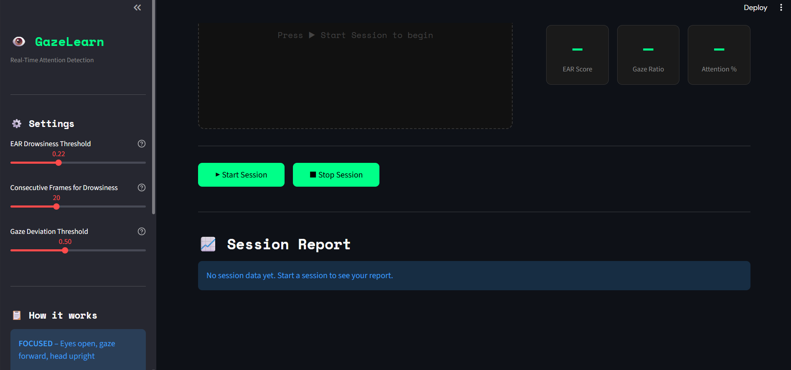
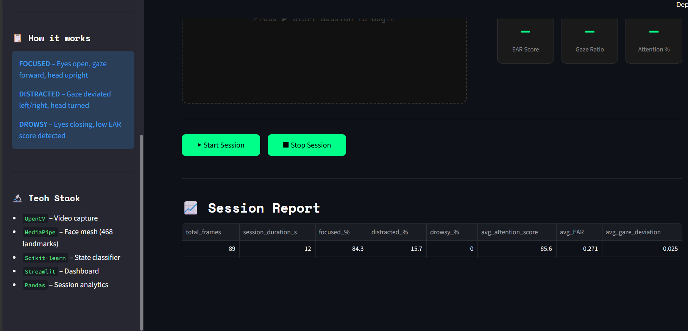

# 👁️ GazeLearn – Real-Time Student Attention Detection System

A computer vision system that detects student attentiveness in real-time using
**MediaPipe FaceMesh**, **OpenCV**, and a **Streamlit** dashboard.

---

## 🔬 How It Works

| Signal | Method | What it detects |
|---|---|---|
| **EAR** (Eye Aspect Ratio) | 6 landmark formula | Drowsiness / eye closing |
| **Gaze Ratio** | Iris position vs eye corners | Distraction / looking away |
| **Head Pose** | Nose-to-face-center offset | Head turning left/right |

### States
- ✅ **FOCUSED** – Eyes open, gaze forward, head upright
- ⚠️ **DISTRACTED** – Gaze deviated or head turned
- 😴 **DROWSY** – Eyes closing for multiple consecutive frames

---

## 🚀 Setup & Run

### 1. Clone / open folder in VS Code
```
cd GazeLearn
```

### 2. Create virtual environment
```bash
python -m venv venv

# Windows
venv\Scripts\activate

# Mac/Linux
source venv/bin/activate
```

### 3. Install dependencies
```bash
pip install -r requirements.txt
```

### 4. Run the app
```bash
streamlit run app.py
```

The dashboard opens at `http://localhost:8501`

---

## 📁 Project Structure

```
GazeLearn/
├── app.py                     # Streamlit dashboard (main entry)
├── requirements.txt
├── utils/
│   ├── __init__.py
│   ├── attention_detector.py  # MediaPipe + EAR + gaze logic
│   └── session_tracker.py     # Per-session logging & reporting
└── README.md
```

---

## ⚙️ Adjustable Parameters (in sidebar)

| Parameter | Default | Effect |
|---|---|---|
| EAR Threshold | 0.22 | Lower = stricter drowsiness detection |
| Consecutive Frames | 20 | Higher = less sensitive drowsy trigger |
| Gaze Deviation | 0.50 | Lower = stricter distraction detection |

---

## 🛠️ Tech Stack

- **Python 3.10+**
- **OpenCV** – Webcam capture & frame annotation
- **MediaPipe FaceMesh** – 468 facial landmarks + iris tracking
- **SciPy** – Euclidean distance for EAR
- **Scikit-learn** – Extendable for ML classifier (see Future Work)
- **Streamlit** – Interactive real-time dashboard
- **Pandas** – Session analytics

---

## 🔮 Future Work

- [ ] Train a proper ML classifier (Random Forest / XGBoost) on labeled session data
- [ ] Export session reports as CSV
- [ ] Multi-face support (classroom mode)
- [ ] Email/notification alerts on prolonged drowsiness
- [ ] Integration with online learning platforms

---

## 👩‍💻 Author

**Janhavi Naik** | B.Tech Computer Technology, YCCE Nagpur  
[GitHub](https://github.com/Janhavi1512) • [LinkedIn](https://linkedin.com/in/janhavi-naik-1b5474270)


## 📸 Screenshots

### 🖥️ Main Dashboard


### ▶️ Session Controls


### 📊 Session Report

